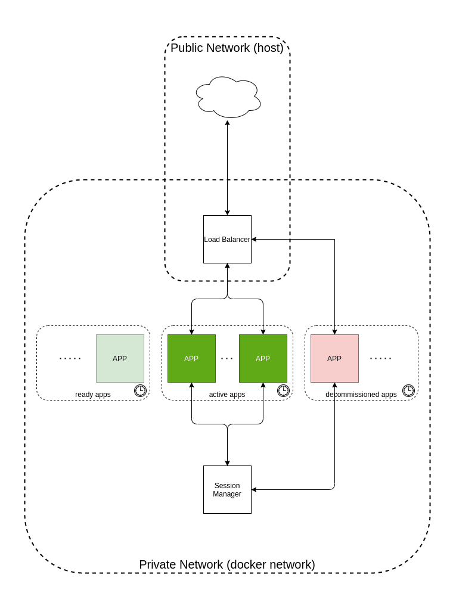

# Moving Target Defence PoC

## System

System consists of three types of applications:

1. Load Balancer (singleton)
1. Session Manager (singleton)
1. Web Application (replicated)



## Web Application

### Creating session storage

```bash
touch session
```

### Logging in

```bash
curl -X PUT \
  -c session \
  -b session \
   http://localhost:8080/login/<your_login>
   
# Response: 
#   500 - error 
#   202 - accepted
```

### Accessing personalized message

```bash
curl -b session http://localhost:8080/

# Response: 
#   500 - error 
#   200 - OK
```

## Session Manager

### Creating new session

```bash
curl -X PUT \
  -d '<json_data>' \
  -H "Content-Type: Application/json" \
  http://localhost:8888/session/<session_id>
  
# Response: 
#   202 - accepted
#   400 - bad request
```

### Accessing session data

```bash
curl http://localhost:8888/session/<session_id>

# Response: 
#   200 - OK
#   404 - not found
```

## Load Balancer

Load balancer is invisible from the perspective of http client.
It only allows for calling Web Application - there is no possibility to reach Session Manager through Load Balancer.

## Development Setup

In order to run the MTD setup locally run 

```
bash docker/build-img.sh
docker-compose -f mtd-system.yml up --force-recreate
```

or run all three applications separately using `python <component>/serve.py`.

To run a single Web Application with Session Manager, run

```
docker-compose -f bare-app.yml up --force-recreate
```

## Performance Testing

Run one of the docker-compose configurations and then run `python client/main.py`.
At this point performance test runner doesn't allow to configure any of the parameters via program arguments.
To change the defaults, edit the `client/perftest.py` file.
